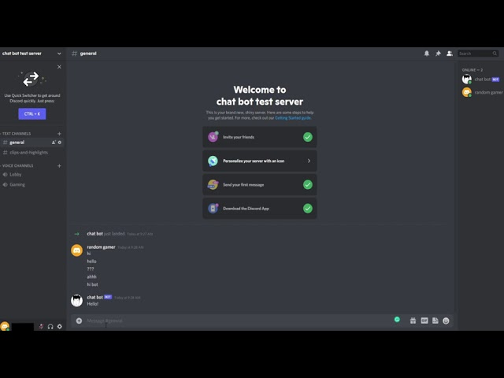
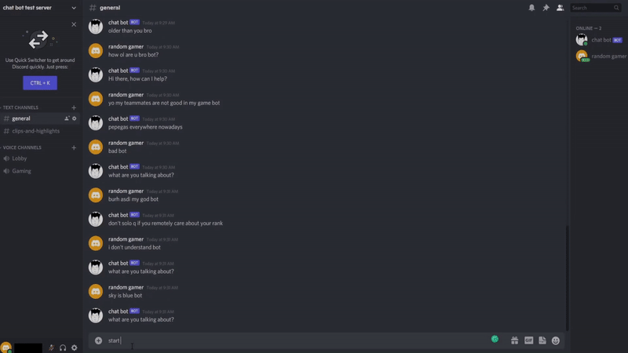
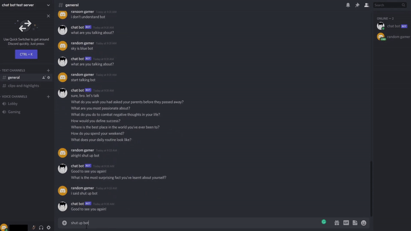
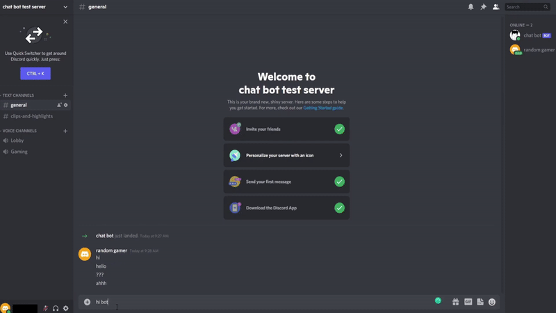
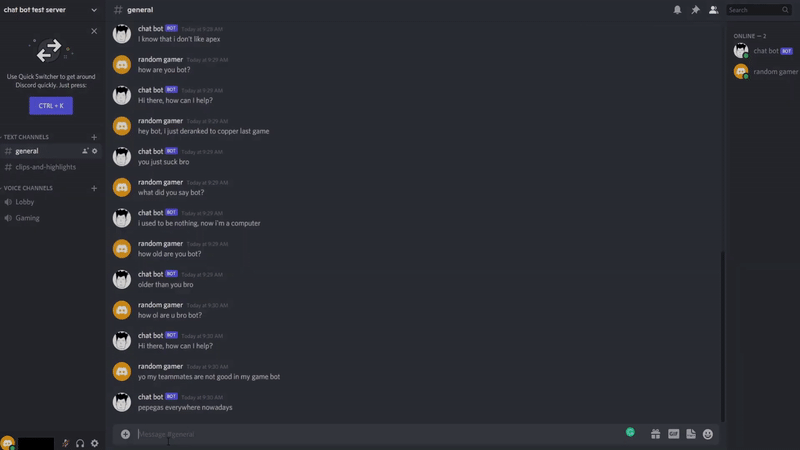

# discordChatBot

## Video Demonstration

## Project Overview
A computer user on a [Discord](https://en.wikipedia.org/wiki/Discord_(software)) server trained with machine learning such that you can have day-to-day conversations with it

## What it does
First, dicordChatBot must be invited to the designated Discord server (which is Discord's terminology for a chat group)

Then, any message you send to the Discord server will be read and interpreted by discordChatBot. And discordChatBot will respond to the messages that it's programmed to respond to. When discordChatBot does not understand a message, it will reply: "What are you talking about?"

There are two types of messages that discordChatBot responds to:
* **commands**: command the bot to perform a certain task
* **conversation topics**: any message that discusses a topic and starts a conversation

Planned/implemented commands:

1. [x] start talking bot: enables random talking

2. [x] shut up bot: disables random talking

3. [x] respond only when message contains "bot"

4. [ ] !changePersona [string]: chatbot changes its persona to designated personality
5. [ ] !changeTone [string]: chatbot changes its tone to designated tone
6. [ ] !enableVC [bool]: chatbot enables/disables VC based on the bool passed in

Conversation topic examples:
* **User**: "hey chatbot" **Chatbot**: "what's up!"
* **User**: "hello chatbot" **Chatbot**: "hi ya"
* **User**: "i am lonely" **Chatbot**: "hey, i'm here bro"
* **User**: "i'm kinda sad" **Chatbot**: "you are not"
* **User**: "bro what you be doing bro?" **Chatbot**: "I'll chat with you?"

In addition to responding to messages, discordChatBot can also start conversations on its own by sending messages once in a while. This feature is enabled/disabled using the **start talking bot** and **shut up bot** command mentioned above

## Notes
* if you want to run this code, you won't be using our application token and thus wouldn't be the same bot as ours
but it will have the same functionality, you can use our bot by inviting it to your server using the link below, however
whether it goes online depends on whether our dev team decides to run it on our own computers
* for some reason, the bot is making some very inaccurate, high confidence predictions for some inputs. It also sometimes get stuck in predicting and i have to ctrl C to exit it, i don't know why
* The bot was hosted on heroku 24/7 through github. However, I had to shut it down since hosting it uses too much resources

## How I built it
Using the TensorFlow, Natural libraries, we built a basic Neural Network that the bot uses to respond to messages intelligently. The neural network is trained using the data contained in [intents.json](intents.json). We also built the [qotd module](./qotd%20module/qotd.js) that allows the bot to talk randomly after a certain time. Lastly, [main.js](main.js) brings everything together by connecting to Discord's API using discord.js and then runs all the functions mentioned above

## What's next for discord chat bot
### List of all features planned & completed:
1. [x] chat module: takes in a message and spits out a response
2. [x] random talks module
3. [x] talk only when mentioned in @ (or "bot" included in message)
4. [ ] speech to text: converts speech in VC to text (using google's speech api)
5. [ ] text to speech: converts the response from chat module to voice (probably using another api)
6. [ ] self-learning: not practical
7. [ ] have a persona
8. [ ] change persona
9. [ ] better node.js interface
10. [ ] small changes: ask user to enter bot key

  